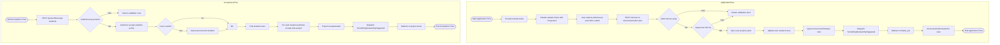
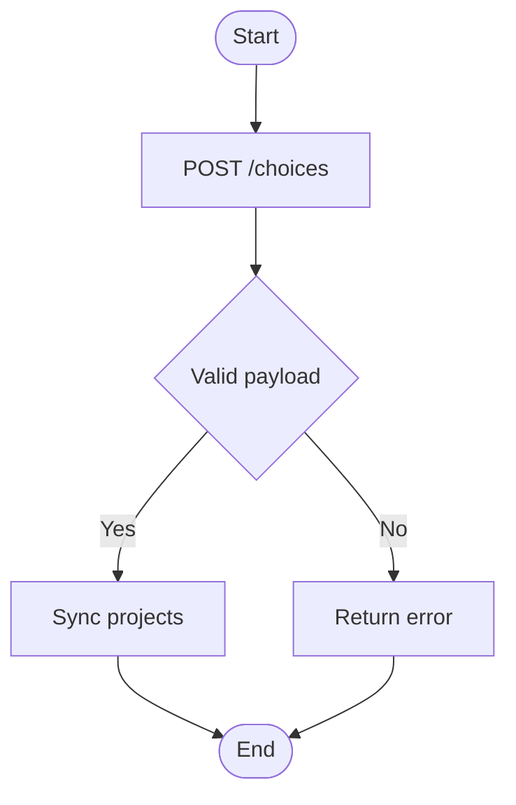

# Code Investigator

A little experiment in AI-powered tools for exploring and finding relevant sections to implement a feature or bugfix.  It can also give you a head start on generating a Readme for the project, produce mermaid diagrams and specifically investigate your tests for gaps or missing code paths.

---

## Installation

Prerequisites
- Git
- Python 3.8+ (installed)
- `uv` tool (see https://docs.astral.sh/uv/)

Clone the repository and install dependencies:

```bash
# Clone
git clone https://github.com/ohnotnow/code-investigator.git
cd code-investigator

# Install dependencies (all platforms)
uv sync
```

## Usage

**Note:** at the moment it is hard-coded to use an OpenAI model - so you need to set your OPENAI_API_KEY appropriately.

Run the main script with `uv`:

```bash
# in code feature/bug mode
uv run main.py --mode=code
# in docs mode
uv run main.py --mode=docs
# in 'mermaid' mode
uv run main.py --mode=mermaid
# in 'testing' mode
uv run main.py --mode=testing
```

In **code mode** this will:

1. Ask you what you want to do with the codebase
2. Get the overall project structure
3. Begin to explore it, read files, search for references
4. Write up a brief description of what changes should be made.

In **mermaid mode** - it will behave similarly to code mode, but
1. Ask you what feature or logic you want to explore
...
4. Generate a report on how that feature works and also write out a mermaidjs flowchart diagram of the logic

In **testing mode** - again it is very similar but will focus specifically on testing of your codebase.  And example of a request to it might be something like :

> Could you suggest any improvements to our Booking Notifications test? What arent we testing, edge cases we have missed? Please look at the back-end controllers etc to check.  tests/Feature/BookingNotificationsTest.php

In **docs mode** it will:

1. Investigate the codebase
2. Try and figure out the main parts, connections features
3. Write out a structured GitHub Readme-style markdown report

#### Extra options
As well as the basic 'mode' you can pass the following :
- `--no-readme`: only for 'docs' mode.  This skips the bit of the prompt which requires the LLM to write in the style of a GitHub readme
- `--request`: Your specific requirements.  In code mode this is passed directly to the LLM as your requirements (if you don't pass it the script will prompt you for it).  In docs mode this is passed to the LLM as extra guidence ontop of the instruction to write in the style of a readme (unless you pass `--no-readme`)
- `--model`: The OpenAI model you want to use.  Eg, 'gpt-4.1', 'o4-mini'.
- `--rewrite`: Make an extra call to get another model rewrite the original output in a slightly less 'dry' style (mostly helpful on side projects or small projects you're just putting out there)

Eg:
```bash
# Ask for specific docs outside of a readme-style context
uv main.py --mode=docs --no-readme --request='Please investigate the RoomBooking feature and document how it works, both front and back end. Also what tests are in place'

# Regular docs readme mode - but with a hint to the LLM about something it might not focus on itself
uv main.py --mode=docs --request='Please pay particular attention to the GDPR code'
```

## Shell functions
It can be useful to set up some default functions in your shell if you use the script a lot.  Eg, in your `~/.bashrc` or `~/.zshrc`:

```sh
readme() {
    source /Users/you/code/code-investigator/.venv/bin/activate
    python /Users/you/code/code-investigator/main.py --mode=docs
    deactivate
}
docs() {
    source /Users/you/code/code-investigator/.venv/bin/activate
    python /Users/you/code/code-investigator/main.py --mode=docs --no-readme --request="$*"
    deactivate
}
investigate() {
    source /Users/you/code/code-investigator/.venv/bin/activate
    python /Users/you/code/code-investigator/main.py --mode=code --request="$*"
    deactivate
}
mermaid() {
    source /Users/you/code/code-investigator/.venv/bin/activate
    python /Users/you/code/code-investigator/main.py --mode=mermaid --request="$*"
    deactivate
}
testing() {
    source /Users/you/code/code-investigator/.venv/bin/activate
    python /Users/you/code/code-investigator/main.py --mode=testing --request="$*"
    deactivate
}
```

And open a new shell or source the file.  Now you can just run things like :
```bash
# generate a readme
$ readme

# generate specific docs on a feature
$ docs 'explain how the Pydantic models relate to each other'

# investigate an issue
$ investigate 'Exception on line 302: main.py - invalid data in timestamp'

# explore how a feature works
$ mermaid 'How does the process for booking time on a piece of equipment work?'

# explore how a feature works
$ testing 'Have we missed any edge cases in our ArchiveInactiveUsers test?'
```

## Example code-mode run

Enter a request: Could we change the admin -> users page to have the email address column before the name column?

- Starting...
- Getting project structure...
- Listing files in app/Http/Controllers/Admin/Users
- Reading app/Http/Controllers/Admin/Users/UserController.php
- Reading resources/views/admin/user/index.blade.php
- Searching for class AllUsers in app/Http/Livewire with 5 before and 5 after
- Listing files in app/Http/Livewire
- Reading app/Http/Livewire/AllUsersStatus.php
- Reading resources/views/livewire/all-users-status.blade.php
- Listing files in resources/views/admin/user
- Reading resources/views/admin/user/partials/admin_menu.blade.php
- Reading resources/views/admin/user/active.blade.php
- Reading app/Http/Livewire/UserList.php
- Reading resources/views/livewire/user-list.blade.php
- Reading resources/views/admin/user/pending.blade.php

1. Codebase Structure Summary
- This is a Laravel 10 application using Livewire components for its admin UI.
- User administration is handled by several Livewire components, notably `AllUsersStatus` (all users/status page) and `UserList` (active users page).
- The “Active Users” admin page renders a table via the Livewire component `UserList`, defined in
  • app/Http/Livewire/UserList.php
  • resources/views/livewire/user-list.blade.php

2. Key Files Examined
- **app/Http/Livewire/UserList.php** – contains the filtering/sorting logic and passes a `$users` collection to the view.
- **resources/views/livewire/user-list.blade.php** – the Blade template that lays out the table with columns: Name, Email, Type, Supervisor.

3. Understanding of Current Implementation
- The table header in `user-list.blade.php` is:
    `<th>Name</th><th>Email</th><th>Type</th><th>Supervisor</th>…`
- In each row, the first `<td>` renders the user’s full name linked to their profile, and the second `<td>` renders the user’s email.
- Sorting by name or email is wired via Livewire (`wire:click.prevent="$set('sortField', 'surname')"` and similarly for email).

4. Implementation Recommendations
To swap the Email and Name columns so that Email appears first:

A. Edit **resources/views/livewire/user-list.blade.php**:

  1. Swap the first two `<th>` elements in the `<thead>` and adjust the sortField hooks:

```diff
     <thead>
-        <tr>
-            <th wire:click.prevent="$set('sortField', 'surname')" class="cursor-pointer">
-                Name @if ($sortField == 'surname') &starf; @endif
-            </th>
-            <th wire:click.prevent="$set('sortField', 'email')" class="cursor-pointer">
-                Email @if ($sortField == 'email') &starf; @endif
-            </th>
+        <tr>
+            <th wire:click.prevent="$set('sortField', 'email')" class="cursor-pointer">
+                Email @if ($sortField == 'email') &starf; @endif
+            </th>
+            <th wire:click.prevent="$set('sortField', 'surname')" class="cursor-pointer">
+                Name @if ($sortField == 'surname') &starf; @endif
+            </th>
             <th wire:click.prevent="$set('sortField', 'type')" class="cursor-pointer">
                 Type @if ($sortField == 'type') &starf; @endif
             </th>
```

  2. In the `<tbody>` loop, swap the first two `<td>` blocks so Email is rendered first:

```diff
     @foreach ($users as $user)
         <tr id="user-row-{{ $user->id }}">
-            <td>
-                <a href="{{ route('user.show', $user->id) }}">{{ $user->full_name }}</a>
-            </td>
-            <td>
-                <a href="{{ route('email.create', ['to' => $user->email]) }}">{{ $user->email }}</a>
-            </td>
+            <td>
+                <a href="{{ route('email.create', ['to' => $user->email]) }}">{{ $user->email }}</a>
+            </td>
+            <td>
+                <a href="{{ route('user.show', $user->id) }}">{{ $user->full_name }}</a>
+            </td>
             <td>
                 {{ $user->type }}
             </td>
```

B. (Optional) If you wish the “Pending Users” table to mirror this column order, apply a similar swap in
   **resources/views/admin/user/pending.blade.php** under the `<table>` there.

5. Reasoning
- The Livewire view template alone dictates column ordering. By swapping the `<th>` and corresponding `<td>` blocks, the email column will render before the name column without affecting any underlying data logic.
- Sorting behavior remains intact, as the same `sortField` bindings are just moved to the appropriate headers.
- This change is minimal, isolated to the view, and maintains consistency with existing Livewire conventions.

----

## Example mermaid-mode run

1. Project Structure Summary
- Laravel PHP application with both Livewire and Vue.js components.
- Key directories:
  • app/Http/Controllers (ChoiceController, ProjectAcceptanceController)
  • resources/js/components (ProjectList.vue)
  • resources/views/student/home.blade.php
  • routes/web.php

2. User Journey Overview
• Student submits project choices via the Vue ProjectList component, invoking ChoiceController.store.
• Admin accepts students onto a project via ProjectAcceptanceController.store.

3. Key Components Identified
- Routes (routes/web.php):
  • GET  “/” → HomeController.index (middleware auth)
  • POST “/choices” → ChoiceController.store
  • GET  “/thank-you” → ChoiceController.thankYou
  • POST “/project/{id}/accept-students” → ProjectAcceptanceController.store (middleware auth, policy)
- Controllers: ChoiceController, ProjectAcceptanceController
- Models: User, Project
- Views/Components: resources/views/student/home.blade.php, ProjectList.vue, resources/views/student/thankyou.blade.php

4. Flow Explanation
Application Flow:
1. Student navigates to home page (GET “/”), sees available projects.
2. ProjectList Vue component renders projects and lets the student pick 5 preferences and a research area.
3. On “Submit my choices”, submitChoices sends POST “/choices” to ChoiceController.store.
4. Controller validates the choices array size and research area, checks max-3 projects per supervisor.
5. On success: syncs pivot table (user.projects), updates user.research_area, queues ChoiceConfirmation email, dispatches an event, redirects to thank-you page.
6. Student sees thank-you view.

Acceptance Flow:
1. Admin submits selected student IDs for a given project via POST “/project/{id}/accept-students”.
2. ProjectAcceptanceController.store validates the “students” array, checks authorization (“accept-students” policy).
3. If the user is admin, it first un-accepts any previously accepted students who are no longer in the submitted list.
4. Finds the student users, for each: checks “accept-onto-project” policy and calls Project.accept(student) to mark them accepted.
5. Dispatches an event, then redirects back to the project show page with success message.

5. Mermaid Diagram


6. Simplified Test Diagram


7. Diagram Explanation
- ApplicationFlow subgraph captures the student application process from viewing projects through final thank-you.
- AcceptanceFlow subgraph details the admin-driven student acceptance process, including policy checks and pivot table updates.
- Decision nodes ({…}) branch on validation and authorization outcomes with “OK/FAIL” labels.
- Process nodes ([…]) denote controller methods, model sync, mail queuing, and events.
- Start/end nodes are enclosed in double brackets to indicate flow boundaries.

---

## License

This project is licensed under the MIT License.
